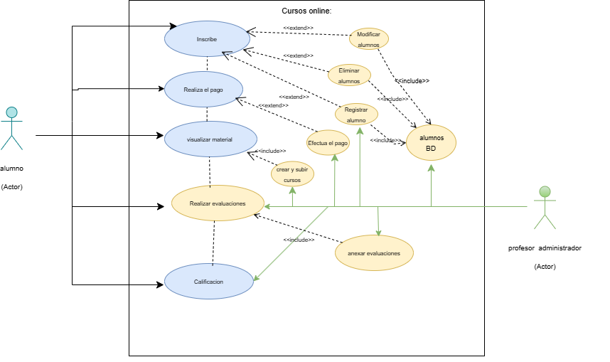

# git-sistema-de-cursos-online

# **¿Qué son los actores y cómo identificarlos?**
Actor es algo o alguien fuera del Sistema que interactúa con el Sistema.
Un actor especifica un rol que alguna entidad externa adopta cuando interactúa con el sistema directamente. Puede representar un rol de usuario o un rol jugado por otro sistema o hardware que toca la frontera del sistema.
La siguiente es la lista de preguntas que permiten identificar a los actores que 

# Actores
|  Actor | XXX (Nombre del Actor) |
|---|---|
| Descripción  | _Alumno_  |
| Características  | _le gusta programacion_ |
| Relaciones | _les gusta pracxticar los arrays con los compañeros_  |
| Referencias | __ |   
|  Notas |  _Suele programar los fines de semana_ |
| Autor  | _Alumno_ |
|Fecha | _01-11-2024_ |

|  Atributo |||
|---|---|---|
| _Nombre_  | _Descripción_  | _Tipo_ |
| | |

----

|  Actor | XXX (Nombre del Actor) |
|---|---|
| Descripción  | _Administrador_  |
| Características  | _le gusta crear cursos_ |
| Relaciones | _Prefiere crear contenido y brindar conocimiento_  |
| Referencias | __ |   
|  Notas |  __ |
| Autor  | _Administrador_ |
|Fecha | _01-11-2024_ |

|  Atributo |||
|---|---|---|
| _Nombre_  | _Descripción_  | _Tipo_ |
| | |

# Case use
Un **caso de uso** es una descripción de cómo un usuario (actor) interactúa con un sistema para lograr un objetivo específico. Define una secuencia de acciones que el sistema lleva a cabo para satisfacer una necesidad del usuario. Los casos de uso son fundamentales para comprender los requisitos y el comportamiento esperado de un sistema.

|  Caso de Uso	CU | XXX  |
  |---|---|
  | Fuentes  | __  |
  | Actor  |  _alumno_ |
  | Descripción | _Descripción del caso de uso_  |
  | Flujo básico | _Descripción paso a paso de la ejecución. (1->2->3.)_ |
  | Pre-condiciones | _Que debe ocurrir con anterioridad_  |  
  | Post-condiciones  | _Que debe ocurrir con posterioridad_  |  
  |  Requerimientos | _Que debe de exister para que el caso de uso se ejecute. Ej: Tarjeta de crédito_  |
  |  Notas |  _Notas adicionales_ |
  | Autor  | _Quien desarrolla la especificación del actor_ |
  |Fecha | _Fecha de la especificación_ |
  Caso de Uso	CU | XXX  |
  |---|---|
  | Fuentes  | _administrador_  |
  | Actor  |  _Actores que participan en el caso de uso_ |
  | Descripción | _Descripción del caso de uso_  |
  | Flujo básico | _Descripción paso a paso de la ejecución. (1->2->3.)_ |
  | Pre-condiciones | _Que debe ocurrir con anterioridad_  |  
  | Post-condiciones  | _Que debe ocurrir con posterioridad_  |  
  |  Requerimientos | _Que debe de exister para que el caso de uso se ejecute. Ej: Tarjeta de crédito_  |
  |  Notas |  _Notas adicionales_ |
  | Autor  | _Quien desarrolla la especificación del actor_ |
  |Fecha | _Fecha de la especificación_ |

  

  **Author: Hadccode**